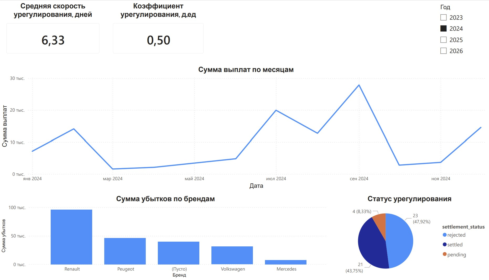

# insurance-etl-pipeline
ETL/ELT pipeline for insurance claims analytics using ClickHouse, dbt, Airflow, and Power BI
# ETL/ELT проект: Аналитика страховых случаев

## 📌 Описание
Построен пайплайн обработки данных страховой компании (автострахование). Исходные CSV-файлы загружаются в ClickHouse, трансформируются через dbt, визуализируются в Power BI.

## 🏗 Архитектура
- **Хранилище**: Yandex Managed ClickHouse
- **Оркестрация**: Apache Airflow (DAG для загрузки из S3)
- **Трансформация**: dbt (многослойная модель: staging → intermediate → mart)
- **Визуализация**: Power BI (дашборд с KPI, графиками)

## 📊 Модель данных
- `stg_claims`, `stg_contracts`, `stg_vehicles` – очищенные сырые таблицы
- `int_claims_enriched` – объединение
- `dm_claims` – витрина

## 🚀 Запуск проекта
1. Создать кластер ClickHouse в Yandex Cloud.
2. Настроить Airflow (переменные окружения, подключения).
3. Установить dbt и выполнить `dbt run`.
4. Подключить Power BI через ODBC.

## 📈 Дашборд (Power BI)
Скриншоты дашборда:  

## 🧰 Технологии
- Python 3.11, dbt-core, dbt-clickhouse
- Apache Airflow 2.10
- ClickHouse 25.8
- Power BI Desktop / Service

## 👩‍💻 Автор
Елена Губайдуллина, https://github.com/elkagrace/insurance-etl-pipeline.git
